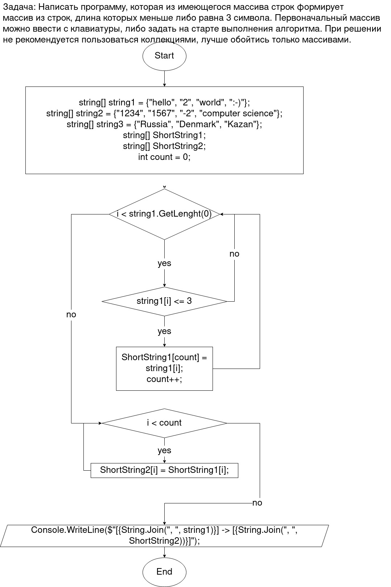

# Итоговая проверочная работа.
A final examination work at GeekBrains for the first quarter.

## Условия задачи.

Написать программу, которая из имеющегося массива строк формирует массив из строк, длина которых меньше либо равна 3 символа. Первоначальный массив можно ввести с клавиатуры, либо задать на старте выполнения алгоритма. При решении не рекомендуется пользоваться коллекциями, лучше обойтись только массивами.

### Блок схема решения лежит по адресу:

https://drive.google.com/file/d/1X9fUxVzd-l85SH9YbNZ3JyA4PZ-jz0ht/view?usp=sharing

Также выгрузил её в репозиторий 

## Описание решения
В решении данной зачали использовал метод, который на вход получает любой массив строк, и, далее, внутри метода, преобразовваеся в новый массив, который содержит только короткие символы.

Первым дело нужно через цикл определить все элементы массива строк, которые были меньше или равны 3 символам.

После этого новый массив, в котором были только эти элементы, а остальное было заполнено ничем, привёл к виду, где все нулы были исключены.
Вот и всё решение.